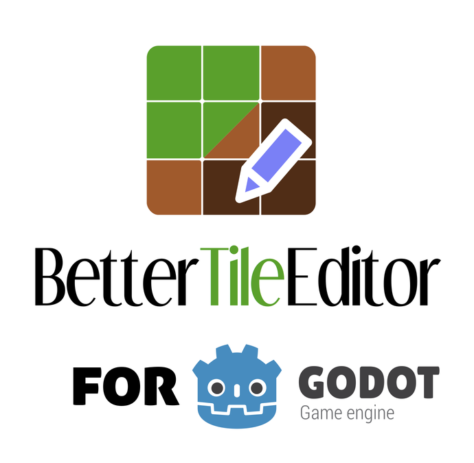

# BetterTileEditor

A fork of [BetterTerrain](https://github.com/Portponky/better-terrain) by
[Portponky](https://github.com/Portponky), with extra terrain modes and editor tools.

## What's added

- Patch terrains
- Multi-tile objects and forest painting
- Scatter painting
- Single-tile and tile-group brushes
- Automatic cliff faces
- Terrain groups, search and favourites
- Terrain thumbnails and previews
- Brush sizes from 1×1 to 8×8
- Map selection, copy, paste and stamping
- Fill by visible area or current layer
- Live terrain updates
- Floating editor dock
- Must-not-match peering, from [BetterTerrain PR #144](https://github.com/Portponky/better-terrain/pull/144)
- A slope tool for 2×1 and 1×1 slopes

## Highlights

- **Patch:** paint a region from a sample, keeping its borders and end pieces.
- **Multi-tile objects:** paint whole trees and other multi-tile objects. Separate
  and joined variants keep the pieces together, even when objects touch.
- **Forest painting:** paint an area to fill it with overlapping trees, including
  clearings. The trees keep their outlines and trunks around the edges.
- **Cliff faces:** paint the plateau and the rock faces follow its edges. Stack
  layers to build terraced hills.

## Must-not rules

A tile can say what may **not** touch one of its sides, not only what must. It
works in Match Tiles terrains, with the usual peering tool:

1. Pick the terrain in the list.
2. Click a side of a tile: it must match that terrain.
3. Click it again: it must **not** (a red crossed-out dot). Click again to go back.
4. Right click clears it.

Forbid a category to forbid every terrain in it, or Decoration to forbid an empty
cell. Use it for tiles defined by what they lack: a notch, a tip, or the corner on
top of a 2×1 slope.

## Slopes

For platformer tilesets with steep (1×1) and gentle (2×1) slopes, on floors and
ceilings. Set them up in **Options → Slopes → Set up slopes…**, which opens over the
dock: click a piece card, then its tile in the atlas (wheel zooms, middle button pans),
and it moves on to the next piece. A tile another piece had is swapped with it.
**Simple** asks only for Ground and the pieces rising right with the ground under them;
rising left and the ceilings are those tiles flipped, as alternative tiles. **Advanced**
lets you pick every piece. The preview shows how the slope tool will paint, and
**Clear slopes** starts over. The plugin makes the slope terrains and their rules;
tilesets with terrains named like `SteepSlopeTL` or `GentleSlope1TL` are read in as
they are. **Add slope rules** adds the rules that let peaks, valleys and the ground
under a slope pick the right tiles.

Once every slope has a tile, the slope tool shows next to the fill tool when one of
those terrains is selected. Drag to draw the ground's surface from the cell you
press: the line snaps to the nearest angle it can draw (flat, gentle 2×1, steep
1×1 or vertical) and ends at the mouse. Flat and vertical lines are plain Ground.
Pressing on the top row of the ground starts a slope up on its surface and a slope
down beside its edge, and a slope
that ends a row or two off the ground beside it is stretched or shortened to join it.
A slope fills Ground below; started under a ceiling it makes a ceiling slope; hold
Shift for a thin diagonal, with no Ground (optional; it needs the thin pieces set up). The preview shows the tiles you'll get.
Right-drag removes. With **Autofill**, next to the Slope button, flat lines also fill
Ground down to the ground below them; with no ground in reach they stay a bar.
With **Freehand** it draws like a pencil: the ground follows the mouse and becomes
gentle or steep slopes or walls by how fast it climbs; going back rubs out, and Shift
keeps it level. **Smooth** flattens bumps one row high up to that many columns wide.

## Install

1. Disable and remove the original BetterTerrain, if installed.
2. Download `better-tile-editor-vX.Y.Z.zip` from the
   [latest release](https://github.com/cidwel/BetterTileEditor/releases/latest).
3. Unzip it into your project folder. You should end up with
   `addons/better-tile-editor/` next to `project.godot`.
4. Enable **BetterTileEditor** in **Project → Project Settings → Plugins**.
5. Select a `TileMapLayer` with a `TileSet` and open the **Terrain** tab.

Keep the folder name `better-tile-editor`. Restart Godot if prompted.

To track the latest changes instead, copy `addons/better-tile-editor` from
[the source](https://github.com/cidwel/BetterTileEditor/archive/refs/heads/main.zip).

## Compatibility

- Godot 4.6+; tested on 4.6 and 4.7
- GDScript and C#
- Same `BetterTerrain` autoload and existing API
- Extra runtime steps for Object, Patch, Scatter and cliffs: see [technical notes](addons/better-tile-editor/DESIGN.md)

## More

- [Technical notes](addons/better-tile-editor/DESIGN.md)
- [Contributing](CONTRIBUTING.md)
- [Report a bug](https://github.com/cidwel/BetterTileEditor/issues) — please include a small reproduction project.
- [GPL v3](LICENSE.md). Upstream BetterTerrain is released under The Unlicense
- Godot logo by Andrea Calabró, [CC BY 4.0](https://creativecommons.org/licenses/by/4.0/)
